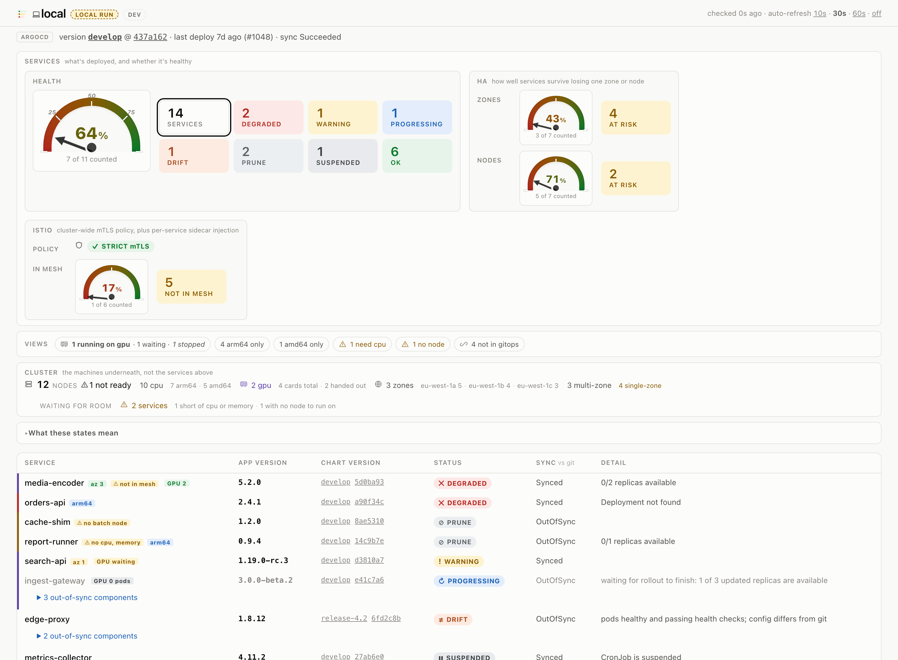

# k8s-status

[](https://github.com/ntmggr/k8s-status/actions/workflows/ci.yml)
[](https://github.com/ntmggr/k8s-status/releases/latest)
[](https://github.com/ntmggr/k8s-status/releases)
[](https://hub.docker.com/r/ntmggr/k8s-status)
[](https://hub.docker.com/r/ntmggr/k8s-status)
[](https://artifacthub.io/packages/helm/k8s-status/k8s-status)
[](https://scorecard.dev/viewer/?uri=github.com/ntmggr/k8s-status)
[](https://www.bestpractices.dev/projects/14260)
[](go.mod)
[](LICENSE)

**What's actually running in your cluster — and whether Git agrees.**

**Rate your cluster: health and HA, at a glance.**

- Want a list of every service and its version, deployed? Done.
- Are your services fully HA? One glance.
- Do you have strict mTLS enforced, cluster-wide? Same glance.
- Are your services actually healthy? Done.

## What is this?

One web page that tells you what is running in a Kubernetes cluster, which version of it,
and whether it is healthy. It also shows what your GitOps controller doesn't know
about: whatever is running outside it. Read-only: it can list, and nothing else.

It reads one cluster and nothing else. It makes no outbound calls. There is no
JavaScript and no database. You open a URL and read a table.

**You do not have to install it.** It is a single binary, so if you would rather not put
anything in the cluster, run it on your own machine against a cluster you can already
read:

```console
$ git clone https://github.com/ntmggr/k8s-status && cd k8s-status
$ ./scripts/local-test.sh cluster <your-kube-context>
```

Then open http://127.0.0.1:8080/k8s-status/. No cluster? Try it with no cluster at all:

```console
$ ./scripts/local-test.sh fixture
```

Both need Go and `kubectl`. The cluster mode uses your kubeconfig, changes nothing, and
installs nothing. It is the fastest way
to decide whether the tool is worth deploying, and it is a reasonable permanent answer
for a cluster you only look at occasionally. Deploy it when you want the page to be
there for everyone, on a URL, without anyone needing cluster access.

The page itself has no login, so it is built to sit behind a VPN or an internal load
balancer. See [Security](#security).

It gets its information from the cluster's GitOps controller. If that name is new to
you: a GitOps controller is a tool that installs software into a cluster by copying what
is written in a Git repository.

Two are supported. **ArgoCD** describes every piece of software it looks after with an
object called an `Application`. **Flux** uses two objects instead, a `HelmRelease` and a
`Kustomization`. `k8s-status` lists whichever of those the cluster has and reports on
each one. ArgoCD alone is the default; see [`SOURCES`](#choosing-the-source).

## What it looks like



Reading across a row: the service, the version running, whether it is healthy, and
whether that matches Git. Badges add what the row alone cannot say. `GPU 2` is holding
two devices, `GPU waiting` wants one and has not got it, `GPU 0 pods` is scaled to zero.
`arm64` means it can only run on that architecture. An amber chip means the scheduler
could not place it, and says what ran out.

<sub>Made-up data from `testdata/`, so anyone can reproduce it with
`./scripts/local-test.sh fixture`. There is a dark theme
([screenshot](docs/screenshot-dark.png)) that follows your system setting.</sub>

## What access does it need?

Read-only, and as little of it as possible. The service can list things. It cannot
create, change, delete or restart anything, and that is enforced by Kubernetes rather
than by the code being polite: the ServiceAccount is only ever granted `get` and `list`.

**By default it gets one namespaced Role, and nothing cluster-wide at all:**

| Where | API group | Resources | Verbs |
|---|---|---|---|
| Role in the `argocd` namespace | `argoproj.io` | `applications` | `get`, `list` |

That is the whole default install. No ClusterRole is created, so the service cannot see
outside that one namespace. It cannot read your Secrets, your ConfigMaps, or anything in
any other namespace.

**The optional features each need more, so each is off by default.** Turning any of them
on requires `rbac.clusterRole=true`, because these resources are not namespaced:

| Feature | Setting | Additionally grants |
|---|---|---|
| Cluster capacity | `config.nodeStats` | `get`, `list` on `nodes` |
| Workloads outside GitOps | `config.unmanaged` | `get`, `list` on `deployments`, `statefulsets`, `daemonsets` |
| Flux support | `config.sources` includes `flux` | `get`, `list` on `helmreleases`, `kustomizations` |

**Mesh mTLS's own Role needs no ClusterRole at all.** It reads one named object in one
namespace, so that half gets its own namespaced Role, independent of
`rbac.clusterRole`. But resolving each service's own policy against namespace- and
workload-scoped overrides needs a second, genuinely cluster-wide grant, since those
overrides can live in any namespace and a Role only ever grants inside one:

| Feature | Setting | Where | Additionally grants |
|---|---|---|---|
| Mesh mTLS (cluster-wide policy) | `config.meshMTLS` | Role in `rbac.istioNamespace` | `get` on `peerauthentications`, restricted to the object named `default` |
| Mesh mTLS (per-service policy) | `config.meshMTLS` (needs `config.azSpread` too, to show it) | its own ClusterRole, always created with `config.meshMTLS`, independent of `rbac.clusterRole` | `list` on `peerauthentications`, cluster-wide, in every namespace |

That second row is a real increase in blast radius, not a formality: it lets the
ServiceAccount read the mTLS policy -- a security-relevant setting -- of every
namespace in the cluster, not only `rbac.istioNamespace`. It is still read-only and
still confined to one CRD.

Still only `get` and `list`. There is no verb anywhere in this project that changes a
cluster, and no code path that issues a write.

**It needs its own ServiceAccount.** There is no way to run it without one. A pod that
does not name a ServiceAccount is given the namespace's `default` account, which is bound
to nothing, so every read comes back 403 and you get the access error page instead of your
services. The chart creates a dedicated account and binds the Role above to it.

Authentication is the projected token at
`/var/run/secrets/kubernetes.io/serviceaccount/token`. There is no kubeconfig, no
credential to supply, and no cloud identity: the ServiceAccount carries no IRSA or
Workload Identity annotation, because the service makes no cloud API calls.

To bind an account you already manage, set `serviceAccount.create=false` and
`serviceAccount.name=<existing-name>`. Granting it the Role above is then yours to do.

If you enable a feature without granting its permission, the page does not break. That
section shows an inline note telling you which Role it needs, and everything else keeps
working.

## Quick start

The fastest way to see it work needs no cluster and no ArgoCD. It serves a bundled
fixture file instead.

```sh
./scripts/local-test.sh fixture
```

That builds the binary, serves the files in `testdata/` over a local port, starts the
app, and prints:

```
mode: fixture (offline, synthetic data)

  page   http://127.0.0.1:8080/k8s-status/
  json   http://127.0.0.1:8080/k8s-status/api/status
  health http://127.0.0.1:8080/k8s-status/healthz
```

Open the first URL. Press Ctrl-C to stop.

The fixture covers the whole page, not just the table: node capacity, GPU allocation,
architecture badges and two services the scheduler could not place. It is the same data
the screenshot above was taken from.

To point it at a real cluster instead, give it a kube context name:

```sh
./scripts/local-test.sh cluster <your-context>
```

That mode uses `kubectl proxy`, so it authenticates as **you**. No token or in-cluster
install is needed. Your own kubeconfig permissions decide what it can read.

## What the states mean

Every row gets exactly one state. The states are checked in order and the first one that
fits wins.

| # | State | Colour | It means | Do you act? |
|---|---|---|---|---|
| 1 | `PRUNE` | grey | ArgoCD wants to delete this but is not allowed to | No. Cleanup backlog. |
| 2 | `DEGRADED` | red | Genuinely broken | **Yes.** |
| 3 | `WARNING` | yellow | The controller cannot tell whether it is healthy | Have a look. |
| 4 | `PROGRESSING` | blue | Currently rolling out | No. Wait. |
| 5 | `SUSPENDED` | grey | Deliberately paused | No. |
| 6 | `DRIFT` | orange | Pods are healthy, but the config no longer matches Git | Not urgent. |
| 7 | `OK` | green | Healthy and matching Git | No. |

`DRIFT` and `PRUNE` are ArgoCD-only. Flux rows never appear in either, see
[What Flux support does not cover](#what-flux-support-does-not-cover).

A few words used above:

- **Sync**, whether what is running matches what is written in Git. `Synced` means yes,
  `OutOfSync` means no.
- **Drift**, running fine, but out of sync. Somebody changed something by hand, or a
  commit has not been applied yet.
- **Prune**, ArgoCD still tracks the object, but nothing in Git asks for it any more. It
  will not delete it unless automatic pruning is switched on, so it sits there reporting
  `OutOfSync` forever.
- **Health**, the controller's own verdict on whether the pods are working.

Rows are sorted worst first, `DEGRADED`, `WARNING`, `PROGRESSING`, `DRIFT`, `PRUNE`,
`SUSPENDED`, `OK`, then alphabetically inside each group. The ordering is stable between
refreshes and the things that need attention are always at the top.

Every state also has its own symbol next to the word, so the page still reads correctly if
you cannot distinguish the colours.

The exact rules, and why `DRIFT` and `PRUNE` are separate states rather than red, are in
[How it works](#how-it-works).

### Health percentage

Above the table sits one number: what share of services are actually `OK` right now.

`PRUNE` and `SUSPENDED` rows are dropped from the count first, a cleanup backlog and a
deliberate pause are not health problems, and then the percentage is `OK` divided by
whatever is left. `PROGRESSING` and `DRIFT` still count as not-OK, so the number is
honest about a rollout in progress rather than looking artificially perfect. When
nothing is left to count (every service pruned or suspended), the page shows `—` instead
of a `0%` or `100%` that nobody could back up.

It is a derived view, not a status tile, for the same arithmetic reason as
[GPU](#cluster-capacity): it would double-count rows the tiles already own.

## Choosing the source

`SOURCES` decides which controllers are read. It defaults to `argocd`, so an existing
install behaves exactly as it always has and never calls a Flux API.

| `SOURCES` | What it reads |
|---|---|
| `argocd` *(default)* | ArgoCD `Application` objects in `ARGOCD_NAMESPACE` |
| `flux` | Flux `HelmRelease` and `Kustomization` objects, cluster-wide |
| `argocd,flux` | Both, in one table |
| `auto` | Whichever of the two the cluster actually serves |

Rules:

- **A source that is not listed is never called.** No request is made to its API at all,
  so it needs no permission and cannot fail.
- `auto` asks the API server which CRDs it serves. It reads the *discovery* endpoints
  (`/apis/argoproj.io/v1alpha1`, `/apis/helm.toolkit.fluxcd.io/v2`,
  `/apis/kustomize.toolkit.fluxcd.io/v1`), which any authenticated client may read, so
  detection needs **no** permission on `customresourcedefinitions`. If detection finds
  nothing, or fails, it falls back to `argocd`.
- An unrecognised value is logged and ignored. `SOURCES=helmfile` starts normally on
  ArgoCD rather than refusing to boot.
- The **Source** column only appears when more than one source is active, so a
  single-source cluster keeps the uncluttered table it has now.

### What Flux support covers

| Flux field | Where it lands |
|---|---|
| `metadata.name`, `metadata.namespace` | Row name; namespace shows in the name's tooltip |
| `spec.suspend` | `SUSPENDED` |
| `status.conditions` | The state, the health word and the detail text |
| **HelmRelease** `spec.chart.spec.version` | Chart version column |
| **HelmRelease** `status.history[0].appVersion` | App version column |
| **Kustomization** `status.lastAppliedRevision` | Chart version column (the branch) and the commit beside it |

Conditions map like this, first match wins:

| # | Condition | State |
|---|---|---|
| 1 | `spec.suspend` is true | `SUSPENDED` |
| 2 | `Ready=False` | `DEGRADED` |
| 3 | `Stalled=True` on its own | `WARNING` |
| 4 | `Reconciling=True` | `PROGRESSING` |
| 5 | `Ready=True` | `OK` |
| 6 | No `Ready` condition, or `Ready=Unknown` | `WARNING` |

Three of those orderings are not obvious and are all driven by what Flux actually writes:

- **Suspend is read from the spec, not inferred from the status.** A suspended object
  keeps whatever conditions it had when it was paused, and a freshly suspended one has
  no conditions at all. Reading the conditions would report stale news as current.
- **`Ready=False` outranks `Reconciling=True`,** because helm-controller leaves
  `Reconciling=True` in place next to a failed `Ready` while it retries. The failure is
  the news.
- **`Reconciling=True` is checked before `Ready=True`.** While kustomize-controller
  reconciles it sets `Ready` to `Unknown` and helm-controller leaves the previous
  `Ready=True` standing, so checking `Ready` first would mislabel both.

`Stalled=True` means Flux has given up retrying. It is almost always reported alongside
`Ready=False`, in which case the row is `DEGRADED` and the detail says
`stalled, no further retries`. On its own it is `WARNING`, something to look at, not
proof of an outage.

### What Flux support does not cover

- **No `DRIFT`.** ArgoCD continuously compares the running manifests against Git and
  publishes the verdict as `Synced` / `OutOfSync`. Flux has no equivalent field: it
  applies and reports whether the apply worked. A Flux row therefore has an empty
  **Sync** column and can never be `DRIFT`. Faking one would be a guess presented as a
  fact.
- **No `PRUNE`.** That comes from the ArgoCD root app's `requiresPruning` flags. Flux
  prunes automatically when `spec.prune` is on, so there is no orphan backlog to report.
- **No environment header.** Version, revision, last deploy and sync phase all come from
  the ArgoCD root Application. On a Flux-only cluster there is none, so the line is
  omitted rather than rendered as a row of blanks.
- **`?sync=Unknown`** is how you select Flux rows in the filter, since they carry no sync
  value.

## Install it on a cluster

Three ways. Pick one. All three are read-only: as shipped, the pod can list ArgoCD
Applications in one namespace and nothing else.

Before you start you need:

- a cluster that already runs ArgoCD or Flux,
- for ArgoCD, the name of the **root Application**, the one Application that owns all
  the others. ArgoCD people call this pattern *app-of-apps*. The default here is
  detected automatically as the Application that owns the most others; set
  `ROOT_APP_NAME` only if your cluster has more than one app-of-apps,
- for Flux, `SOURCES` set to include `flux` and the extra permission described in
  [Optional extras](#optional-extras).

### 1. Plain manifest (no Helm needed)

`deploy/install.yaml` is one self-contained file: Namespace, ServiceAccount, Role,
RoleBinding, ConfigMap, Deployment, Service. Nothing cluster-wide.

```sh
./scripts/install.sh <your-context> <registry>/k8s-status:<tag> [env-name]
```

The script substitutes the image, environment name and cluster name, applies the file, and
waits for the rollout. Remove it with:

```sh
kubectl --context <your-context> delete -f deploy/install.yaml --ignore-not-found
```

To change settings afterwards, edit the `k8s-status` ConfigMap and restart the Deployment.
Every key is in [Settings](#settings).

### 2. Helm chart

The chart lives in `charts/k8s-status/` and has its own
[README](charts/k8s-status/README.md) with a full values table. Each release also
publishes it as an OCI artifact, so a checkout is not required:

```sh
helm upgrade --install k8s-status oci://ghcr.io/ntmggr/charts/k8s-status \
  --version <released version, e.g. 0.12.5> \
  --namespace k8s-status --create-namespace \
  --set config.envName=<env> \
  --set config.clusterName=<cluster>
```

Or from a checkout, with a specific image build:

```sh
helm upgrade --install k8s-status charts/k8s-status \
  --namespace k8s-status --create-namespace \
  --set image.repository=<registry>/k8s-status \
  --set image.tag=<tag> \
  --set config.envName=<env> \
  --set config.clusterName=<cluster>
```

Or let the install script do it:

```sh
./scripts/install.sh --helm <your-context> <registry>/k8s-status:<tag> [env-name]
```

Remove it with `helm uninstall k8s-status --namespace k8s-status`.

### 3. Let ArgoCD install it

Point an ArgoCD Application at the chart. Per-cluster settings go under `helm.values`.

```yaml
apiVersion: argoproj.io/v1alpha1
kind: Application
metadata:
  name: k8s-status
  namespace: argocd
spec:
  project: default
  source:
    repoURL: <this-repo-url>
    targetRevision: main
    path: charts/k8s-status
    helm:
      values: |
        image:
          repository: <registry>/k8s-status
          tag: "<tag>"
        config:
          envName: <env>
          clusterName: <cluster>
          region: <region>
  destination:
    server: https://kubernetes.default.svc
    namespace: k8s-status
  syncPolicy:
    automated:
      prune: true
      selfHeal: true
    syncOptions:
      - CreateNamespace=true
```

Note: the Role and RoleBinding are created in the ArgoCD namespace, not in the destination
namespace. If your ArgoCD project restricts namespaces, allow both.

## How to reach it

### Port-forward (nothing to set up)

Works immediately, needs no DNS, no ingress and no load balancer.

```sh
kubectl --context <your-context> -n k8s-status port-forward svc/k8s-status 8080:80
open http://127.0.0.1:8080/k8s-status/
```

### Ingress or Istio

Both are off by default in the chart. Turn on the one your cluster uses.

```sh
# Ingress
helm upgrade --install k8s-status charts/k8s-status \
  --set ingress.enabled=true \
  --set ingress.className=nginx \
  --set ingress.host=status.example.internal
```

```sh
# Istio VirtualService
helm upgrade --install k8s-status charts/k8s-status \
  --set istio.enabled=true \
  --set 'istio.gateway={my-gateway}' \
  --set 'istio.hosts={status.example.internal}'
```

**Do not add a path-rewrite rule.** The app already serves everything under `BASE_PATH`
(`/k8s-status` by default) itself. Neither the chart's Ingress nor its VirtualService
rewrites the path, on purpose. If you strip the prefix in a proxy, the app will 404.

That same design is what lets you hang it off a subpath of an existing hostname without
touching anything else.

### Routes

Everything below is relative to `BASE_PATH`.

| Route | What you get |
|---|---|
| `GET <base>/` | The HTML page |
| `GET <base>/api/status` | JSON, always HTTP 200 |
| `GET <base>/healthz` | `200 ok` |
| `GET <base>` | `302` redirect to `<base>/` |

`/api/status` always returns 200 on purpose. That lets a monitoring script tell two things
apart:

- app is up, but the cluster read failed → 200, `"error"` is set, `"services": []`
- app is down → connection refused or a 5xx

`/healthz` never touches the Kubernetes API. If ArgoCD breaks or the token is revoked, the
pod must **not** be restarted, restarting fixes neither.

## Filtering the table

All filtering is done with query parameters, so it needs no JavaScript. The page has no
`<script>` tag at all. Auto-refresh re-requests the current URL including its query string,
so your filter survives every refresh.

| Parameter | Example | Meaning |
|---|---|---|
| `?status=` | `?status=DEGRADED` | Show only that state |
| `?sync=` | `?sync=OutOfSync` | `Synced` / `OutOfSync` / `Unknown` |
| `?gpu=` | `?gpu=true` | GPU services only, or `false` for non-GPU only |
| `?refresh=` | `?refresh=60` | Override the refresh interval. `0` turns it off |

Rules:

- Repeat a parameter or comma-separate it: `?status=DEGRADED&status=DRIFT` and
  `?status=DEGRADED,DRIFT` do the same thing.
- Values inside one parameter are OR. Different parameters are AND. So
  `?status=DEGRADED,DRIFT&gpu=true` means "(DEGRADED or DRIFT) **and** GPU".
- Matching ignores case and surrounding spaces.
- A value that matches nothing (`?status=BANANAS`) shows an empty table with the filter
  chips still visible. It does not 500 and it does not silently show everything.
- `?refresh=` is clamped. Anything non-numeric or negative falls back to
  `REFRESH_SECONDS`. Non-zero values are held between 5 and 3600 seconds.

The status tiles at the top are links. Click one to filter, click the active one to clear
it. Active filters appear as chips with an `x` to remove just that one, plus a
`showing N of M` count.

**The tiles keep counting the whole cluster while a filter is on.** That is deliberate. If
they counted only the filtered rows, clicking `DEGRADED` would make every other tile read
`0` and you would lose your bearings. The same holds for `summary` in the JSON;
`filters.matched` carries the filtered count.

`/api/status` accepts the same parameters and echoes them back:

```json
{"filters":{"status":["DEGRADED","DRIFT"],"gpu":"true","matched":16}}
```

`/healthz` ignores all of it.

### Getting versions as JSON

`GET <base>/api/versions` answers one question: what is deployed here, and at what version.

```console
$ curl -s http://localhost:8080/k8s-status/api/versions | jq '.services[0]'
{
  "name": "accounts-api",
  "appVersion": "2.4.1",
  "chartVersion": "develop",
  "revision": "3c9646b1f0aa27de4b55c8e910d3f7a204ce18bb",
  "image": "registry.example.invalid/platform/accounts-api:2.4.1",
  "source": "argocd",
  "state": "OK"
}
```

`appVersion` is the running container image tag, the version of the software itself.
`chartVersion` is the git ref the GitOps controller tracks for it. They are different
things and the endpoint reports both.

It takes the same filters as the page, so `?status=DEGRADED` or `?gpu=true` narrows it.
`/api/status` returns the same facts plus health, counts and components, if you want
everything in one call.

Just the name and version of every service, one line each:

```console
$ curl -s http://localhost:8080/k8s-status/api/versions | jq -r '.services[] | "\(.name) \(.appVersion)"'
accounts-api 2.4.1
admin-ui 1.15.0
media-encoder 5.2.0
...
```

## Settings

Everything is read from environment variables at startup. Every one has a default, so you
can run it with none of them set.

| Variable | Default | What it does |
|---|---|---|
| `ENV_NAME` | `unknown` | Name shown in the page header, e.g. `sample-dev` |
| `ENV_TYPE` | *(empty)* | `dev` / `stage` / `prod`. If empty, taken from the root app's `EnvType` label |
| `CLUSTER_NAME` | *(empty)* | Cluster name shown in the header and footer |
| `REGION` | *(empty)* | Region shown in the header, e.g. `eu-west-1` |
| `BASE_PATH` | `/k8s-status` | Path prefix the app serves. Normalized to a leading slash with no trailing slash. Empty means serve at `/` |
| `ARGOCD_NAMESPACE` | `argocd` | Namespace that holds the ArgoCD `Application` objects |
| `ROOT_APP_NAME` | *(detected)* | Root Application that owns all the others. Empty picks the Application owning the most others; set it only with more than one app-of-apps |
| `ARGOCD_UI_BASE` | *(empty)* | If set, service names link to `<base>/applications/<name>` in the ArgoCD UI |
| `IGNORE_GLOBS` | *(empty)* | Comma-separated name patterns to hide. Matches are removed from the table and from every count, and reported as `hidden` |
| `GPU_GLOBS` | *(empty)* | Fallback only. Name patterns marking a service as GPU-backed, used when the workload read that powers real detection is not available |
| `SIDECAR_IMAGES` | *(built-in list)* | Image names that never carry the service version, such as an injected proxy. Replaces the built-in list |
| `PENDING_REASONS` | `false` | Explain why a service's pods cannot be scheduled. Reads pending pods. Needs a ClusterRole |
| `ACCELERATOR_RESOURCES` | *(discovered)* | Resources that count as accelerators. Empty discovers them from what the nodes advertise |
| `NODE_STATS` | `false` | Show the cluster capacity section. Needs a ClusterRole, see [Optional extras](#optional-extras) |
| `UNMANAGED` | `false` | Show the "not managed by ArgoCD" section. Needs a ClusterRole, see [Optional extras](#optional-extras) |
| `UNMANAGED_IGNORE_NS` | *(empty)* | Comma-separated namespace patterns to leave out of that section |
| `MESH_MTLS` | `false` | Show the cluster-wide Istio mTLS gauge. Needs a namespaced Role, see [Optional extras](#optional-extras) |
| `MESH_NAMESPACE` | `istio-system` | Namespace holding the mesh-wide `PeerAuthentication` object |
| `CACHE_TTL_SECONDS` | `15` | How long a fetched snapshot is reused |
| `REFRESH_SECONDS` | `30` | Default page auto-refresh interval. A viewer can override it with `?refresh=` |
| `PORT` | `8080` | Port to listen on |
| `KUBERNETES_SERVICE_HOST` | *(injected by Kubernetes)* | Used to build the API server URL |
| `KUBERNETES_SERVICE_PORT` | `443` | Used to build the API server URL |
| `KUBE_API_URL` | *(empty)* | Local development only. Overrides the in-cluster API URL |
| `KUBE_TOKEN_FILE` | `/dev/null` | Local development only. Token file used with `KUBE_API_URL` |

Patterns use Go's `path.Match` syntax: `*` matches any run of characters except `/`, `?`
matches one character, `[abc]` matches a character class. So `kube-*` matches `kube-system`
and `payments-*` matches `payments-api`.

Accelerators are discovered, not enumerated. Any vendor-qualified resource the nodes
advertise counts, so NVIDIA cards, NVIDIA MIG slices, AMD, Intel, AWS Neuron and TPUs
all work without configuration. Built-in resources are excluded because they carry no
vendor domain, as are `hugepages-*` and the `vpc.amazonaws.com/*` network attachments
that EKS advertises when security groups for pods are enabled. `ACCELERATOR_RESOURCES`
replaces the whole discovery if a cluster needs something this does not cover.

`GPU_GLOBS` is empty by default, because GPU services are detected rather than guessed.
A service is marked as GPU-backed when a workload it owns requests `nvidia.com/gpu`,
read from the workload list already fetched for the unmanaged view. That means it costs
no extra request, needs no site-specific pattern list, and cannot drift out of date when
a service moves off GPU nodes.

A row is greyed out, with a yellow chip naming the reason, when the scheduler could not
place its pods. Two shapes turn up in practice:

| Chip | Message behind it |
|---|---|
| `no cpu, memory` | the cluster is out of that resource |
| `no matching node` | every node was excluded by affinity or a taint, so the nodegroup it is pinned to is empty |

This reads the `PodScheduled` condition of pods still in Pending, and needs `get`/`list`
on `pods` via `PENDING_REASONS`, off by default. That is the widest permission this
project asks for, so it is opt-in and the chart grants it only when the flag is on.

FailedScheduling events were tried first, precisely to avoid that permission. They are
wrong often enough to matter: an event outlives the problem it describes by up to an
hour. On a live cluster every pod of a service was Running while stale events still
reported a cpu shortage, and the page showed a service as blocked that was serving
traffic. A condition on a pending pod cannot say that, because the pod stops being
pending.

Only `metadata` and `status` are decoded, never `spec`, so the process never holds an
environment value. That limits the blast radius; the grant itself is still the control.

A pod is matched back to its service through `ownerReferences`, since a Deployment's pod
is owned by a ReplicaSet named `<deployment>-<hash>`. Name prefix is the fallback,
longest match first, so `api` does not claim a pod belonging to `api-canary`.

Every GPU row also carries what it asks for and what it holds: devices per replica,
replicas ready against desired, and the resulting allocation. That separates three
things a boolean marker hides, which is the point of it:

| Badge | Means |
|---|---|
| `GPU 2` | running and holding that many devices |
| `GPU waiting` | wants devices and has not got any: none free, or no node to run on |
| `GPU 0 pods` | no replicas requested, so nothing is running and no device is held |

A badge with no number is a service that reaches a device through the runtime without
requesting one, so the count is not knowable. The three states are coloured apart rather
than left to a tooltip, because on a real cluster most GPU services had no pods and
one was stuck, and a single badge said the same thing about all of them.

The zero-replica case is deliberately not called "idle". Idle describes a device that is
allocated and doing no work, which is a utilisation fact this project cannot see: it
reads the Kubernetes API, not the hardware. What it knows is that no replicas were asked
for. Whether that is a deliberate stop or an autoscaler at rest is not visible from the
workload either, so the badge states the fact and stops there.

`waiting` is the one worth acting on. A row also carries `measured: false` when the
service never requests a device and reaches one through the runtime, because then the
per-replica and allocated numbers cannot be trusted. That is separate from the state,
since such a service can still be stuck.

The capacity line totals the same thing cluster-wide, as `N cards, M allocated`. The gap
is hardware nothing has claimed.

That total is a floor rather than a complete figure. It counts devices the scheduler was
asked for, so a service that reaches one through the runtime without requesting it adds
nothing. Those are counted separately and shown as `N uncounted`, because a total that
quietly omits them reads as though it were the whole story.

Detection is by container resources, not by which node a pod landed on. A DaemonSet
scheduled onto a GPU node is not a GPU workload, and a service scaled to zero still is
one.

A cluster can have GPUs that Kubernetes cannot schedule. Access to a device comes from
the driver and the container runtime; only *allocation* needs a device plugin. Where the
runtime injects devices by default, workloads use the GPU perfectly well while the node
advertises no capacity at all. Nodes carrying a `.../gpu.present=true` label with nothing
allocatable still count as GPU nodes, and the page says `no device plugin` instead of
printing a card count it cannot know. Services pinned to them are marked as GPU-backed,
because the runtime does hand them the device.

This matters more than it sounds. A production cluster running dozens of GPU nodes that serve
live traffic reported `0 gpu, 0 cards` under the earlier rule, because it counted only
what the scheduler could allocate. The card count genuinely is not discoverable without
a plugin, but the nodes are unmistakably there.

If you do not enable the workload read (`UNMANAGED`, or `rbac.clusterRole`), nothing is
detected and no service is marked. Set `GPU_GLOBS` to fall back to name matching in that
case; patterns are matched against the Application name and need no extra permission.

Nothing is read from a config file. The service account token is never logged.

### JSON output

```json
{"schema":1,"env":"sample-dev","envType":"dev","region":"eu-west-1",
 "clusterName":"sample-dev-cluster","clusterPath":"sample-dev-cluster",
 "version":"develop","revision":"437a162...","rootHealth":"Degraded","rootSync":"OutOfSync",
 "phase":"Succeeded","message":"successfully synced (all tasks run)",
 "lastDeployedAt":"2026-08-21T11:30:57Z","lastDeployId":1048,
 "summary":{"total":151,"ok":137,"degraded":3,"warning":0,"progressing":2,
            "drift":0,"prune":9,"suspended":0,"hidden":0,"gpu":47},
 "services":[{"name":"accounts-api","version":"develop","revision":"3c9646b...",
              "state":"DEGRADED","sync":"OutOfSync","health":"Degraded",
              "detail":"0/2 replicas available"}],
 "checkedAt":"2026-08-24T09:10:11Z","ageSeconds":4,"stale":false,"error":null}
```

`detail` and `message` are cut off at 200 characters.

Two objects appear only when their feature is on:

```json
{"nodes":{"total":82,"cpuNodes":74,"gpuNodes":8,"gpus":14,"gpuServices":47,
          "arch":{"amd64":16,"arm64":66}}}
```

```json
{"unmanaged":{"count":11,"scanned":503,
              "items":[{"namespace":"kube-system","kind":"DaemonSet","name":"kube-proxy",
                        "managedBy":"unknown","ready":81,"desired":82,
                        "version":"v1.35.3-eksbuild.19","state":"DEGRADED"}]}}
```

## Optional extras

All three extras below are **off by default**, though not all for the same reason.

The normal install has a namespaced `Role`. It can read ArgoCD Applications in one
namespace and nothing else. That is the whole permission surface, and you can check it by
reading eight lines of YAML.

Cluster capacity and unmanaged workloads read things that live outside any single
namespace, which a `Role` cannot do. That needs a **ClusterRole**, a permission that
applies cluster-wide. So each of those two extras needs two switches flipped: the
feature, and the permission.

If you turn the feature on but not the permission, nothing breaks. The read is denied, that
one section shows a short note explaining what is missing, and the rest of the page renders
normally. An optional feature that is denied degrades, it never breaks the page.

| Feature | Env var | Chart value | Extra permission |
|---|---|---|---|
| Cluster capacity | `NODE_STATS=true` | `config.nodeStats=true` | `get`/`list` on `nodes` |
| Unmanaged workloads | `UNMANAGED=true` | `config.unmanaged=true` | `get`/`list` on `deployments`, `statefulsets`, `daemonsets` in `apps` |

With Helm, add `--set rbac.clusterRole=true`. With `deploy/install.yaml`, uncomment the
ClusterRole and ClusterRoleBinding block near the top. Each rule is gated on its own
feature, so turning one on does not grant the other.

**Mesh mTLS's cluster-wide policy read is not one of these two.** It reads a single
named object in a single namespace, so it needs no `rbac.clusterRole=true` at all — it
gets its own namespaced `Role` instead. Its **per-service** policy read is different:
resolving namespace- and workload-scoped overrides needs a cluster-wide `list`, since
those overrides can live in any namespace, so it gets its own dedicated ClusterRole,
still independent of `rbac.clusterRole`:

| Feature | Env var | Chart value | Extra permission |
|---|---|---|---|
| Mesh mTLS (cluster-wide) | `MESH_MTLS=true` | `config.meshMTLS=true` | `get` on `peerauthentications`, restricted by `resourceNames` to the object named `default`, in `rbac.istioNamespace` |
| Mesh mTLS (per-service) | `MESH_MTLS=true` and `AZ_SPREAD=true` | `config.meshMTLS=true` | `list` on `peerauthentications`, cluster-wide, in every namespace |

With Helm this needs no `rbac.clusterRole=true`; both the Role/RoleBinding and the
ClusterRole/ClusterRoleBinding render whenever `config.meshMTLS=true`, on their own
gate. With `deploy/install.yaml`, uncomment the separate Role/RoleBinding and
ClusterRole/ClusterRoleBinding blocks for it. `resourceNames` plus `get`-only on the
namespaced Role means the ServiceAccount can read exactly that one object and cannot
list or enumerate anything else in the namespace, which is why the mesh-wide read does
a single-object `GET` rather than a list; the ClusterRole is the deliberate exception
to that, because a per-service answer needs to see overrides in namespaces it does not
otherwise touch at all. It is still `list`-only, no `get`, since the list response
already carries every object's full spec.

Check for yourself which render is clean and which is not:

```sh
helm template k8s-status charts/k8s-status | grep -c '^kind: ClusterRole$'                              # 0
helm template k8s-status charts/k8s-status --set config.meshMTLS=true | grep -c '^kind: ClusterRole$'   # 1
```

### Cluster capacity

Shows total nodes, CPU nodes, GPU nodes, total GPUs, GPU services and the CPU architecture
split.

- A node counts as a GPU node when `.status.capacity["nvidia.com/gpu"]` is above zero.
  That key comes from the standard NVIDIA device plugin, so it works on any cluster; a
  node-group label would not.
- A missing or unreadable value counts as zero rather than failing the read.
- Only three fields are decoded: `metadata.name`,
  `status.capacity["nvidia.com/gpu"]` and `status.nodeInfo.architecture`.

GPU is reported here rather than as a status tile. The status tiles are mutually exclusive
and add up to the service total, and a GPU service is already counted in `OK` or
`DEGRADED`. Putting it in the tile row would break the arithmetic. The per-row `GPU` chip
and the coloured row edge are unaffected.

### Workloads that ArgoCD does not manage

Shows what is running in the cluster **outside** of Git: EKS addons, components installed
by Terraform, Helm releases somebody installed by hand. Nobody is watching these for you,
so this is where undetected drift lives.

It reads every `Deployment`, `StatefulSet` and `DaemonSet` in the cluster. A workload is
listed when **both** of these are true:

1. It has no ArgoCD ownership marker. ArgoCD stamps everything it owns with at least one
   of: the `argocd.argoproj.io/tracking-id` annotation, the `app.kubernetes.io/instance`
   label, or the `argocd.argoproj.io/instance` label.
2. It has no `metadata.ownerReferences`, nothing in the cluster created it.

Each row shows:

| Column | Where it comes from |
|---|---|
| Service, namespace, kind | `metadata` |
| Installed by | The `app.kubernetes.io/managed-by` label. Observed values are `Helm`, `EKS` and `terraform`. Empty shows as `unknown` |
| App version | The `app.kubernetes.io/version` label when the workload is part of a Helm release, otherwise the tag of the first container's image |
| Chart version | The version suffix of the `helm.sh/chart` label (e.g. `1.14.4` from `cert-manager-1.14.4`). Empty when the workload is not Helm-managed or carries no chart label |
| Ready / desired | `status.readyReplicas` / `status.replicas` for Deployment and StatefulSet; `status.numberReady` / `status.desiredNumberScheduled` for DaemonSet. A missing field counts as 0 |
| Status | `OK` when ready equals desired and desired is above 0; `DEGRADED` when ready is below desired; `SUSPENDED` when desired is 0 |

`SUSPENDED` for a 0/0 workload is not a fudge. A Windows DaemonSet on a cluster with no
Windows nodes is legitimately 0/0 and must not show as broken. Conversely, `81/82` on a
DaemonSet is a real signal, one node is not covered, so the comparison is exact, never
approximate.

Use `UNMANAGED_IGNORE_NS` to hide namespaces you have already accepted, for example
`UNMANAGED_IGNORE_NS=kube-system,gpu-*`.

**The `ownerReferences` check is the important one, and it is not obvious.** On a live dev
cluster the marker check alone listed 292 workloads. Almost all of them were `autoc-<uuid>`
Deployments created on demand by an operator running inside the cluster; they inherit no
ArgoCD label, so they look unmanaged. Adding the `ownerReferences` check removes every one
of them, because a workload with an owner was created by something already in the cluster
rather than installed into it. The list drops to 11, and all 11 are real infrastructure. Do
not remove that check to simplify the code, the list becomes unreadable.

The count also appears in the cluster capacity section, not in the status tiles, for the
same arithmetic reason as GPU.

When `AZ_SPREAD` is also on, these workloads' zone/node spread folds into the HA gauges
(Zones/Nodes) the same way a tracked service's would: a zone or node failing affects them
identically, so excluding them would understate real blast radius. Their Istio sidecar
injection and effective policy, when `MESH_MTLS` is also on, do **not** fold into the
Istio gauges the same way -- those percentages describe GitOps-tracked services
specifically. Instead, each row still gets its own "not in mesh" / policy-override badge,
and the Istio panel shows a one-line note summarising how many not-in-gitops workloads
were checked and how many of them are in mesh or permissive.

### Mesh mTLS

Shows whether Istio is installed and, if so, the cluster-wide mTLS posture: `STRICT`,
`PERMISSIVE`, or disabled.

- Istio is detected via discovery (`HasResource`), the same mechanism `SOURCES=auto`
  uses for ArgoCD and Flux; no Istio CRD served means no mesh, rendered as a neutral
  "no service mesh detected", never as a warning.
- When Istio is present, the mesh-wide `PeerAuthentication` named `default` in
  `MESH_NAMESPACE` is read by name, not listed. No object at all is Istio's own
  PERMISSIVE default, and is reported as such rather than as "unknown". `mode: UNSET`
  inherits that same PERMISSIVE default.
- If that `default` object carries a `spec.selector`, it is actually scoped to one
  workload rather than the whole mesh, and the page says so.

Alongside that cluster-wide answer, when `AZ_SPREAD` is also on, each service gets two
more per-service answers, both read from the same running-pods list AZ_SPREAD already
fetches, no separate fetch of their own:

- **Sidecar injection**: how many of a service's running pods carry an `istio-proxy`
  container. Injection only, never enforcement — a service can carry the sidecar on
  every pod without STRICT mTLS applying to it, since that depends on policy, not on
  whether a sidecar is present.
- **Its own effective policy**: namespace- and workload-scoped `PeerAuthentication`
  objects can override the cluster-wide default for individual services, and this is
  what actually reads them, following Istio's own precedence rules
  ([reference](https://istio.io/latest/docs/reference/config/security/peer_authentication/)):
  workload-specific (a `PeerAuthentication` in the service's own namespace whose
  `spec.selector.matchLabels` match its pods' labels) beats namespace-wide (same
  namespace, empty selector) beats the cluster-wide default above. `mode: UNSET` at a
  narrower scope falls through to the next broader one rather than stopping the
  search. If two workload-scoped objects in one namespace both match the same pod,
  Istio's own behaviour is undefined; this page picks whichever comes first in the
  list Kubernetes returned, deterministically, and does not claim that choice is
  "correct" — Istio itself defines no correct answer there.

  This needs a second, genuinely cluster-wide permission beyond the single-object read
  above — see [Optional extras](#optional-extras) — because an override can live in any namespace, not only
  `MESH_NAMESPACE`. A denied or failed read there degrades the same way every other
  optional read in this project does: the per-service answer is simply not shown, the
  cluster-wide gauge above is unaffected.

  Surfaced as a "permissive" tile in the Istio panel (`?mesh=permissive` narrows the
  Services table to exactly those rows) and a per-row badge naming the scope and mode
  whenever a service's own effective policy differs from the cluster-wide default,
  e.g. "workload override: disabled". `STRICT`/`DISABLE` effective modes get no tile
  of their own, only the row badge — nobody asked to filter on those, and adding a
  tile with no way to discover it from would be dead weight.

## How it works

### Where the numbers come from

Applications are split into the root app (`metadata.name == ROOT_APP_NAME`) and its
children. The root's `status.resources[]` entries carry a `requiresPruning` flag, keyed by
resource name; that map is the only source of prune information. `rootSettled` means the
root's `status.operationState.phase` is not `Running`. An empty `health.status` becomes
`Unknown`.

Each child is then matched against these rules, first match wins:

| # | Condition | State |
|---|---|---|
| 1 | Marked `requiresPruning` by the root app | `PRUNE` |
| 2 | Health is `Degraded` or `Missing` | `DEGRADED` |
| 3 | Health is `Unknown` or empty | `WARNING` |
| 4 | Health is `Progressing`, **or** the root sync is still running and the child is `OutOfSync` | `PROGRESSING` |
| 5 | Health is `Suspended` | `SUSPENDED` |
| 6 | Child is `OutOfSync` and the root sync has finished | `DRIFT` |
| 7 | Anything else | `OK` |

Rule 4 sits **above** rule 6 on purpose. During a normal sync, children go `OutOfSync`
while they are `Progressing`. Flagging that would set off an alarm on every commit. Rule 6
therefore only fires on settled drift: ArgoCD has finished and the cluster still does not
match Git.

### Why DRIFT is not red

A `DRIFT` service is healthy. Its pods pass their readiness and liveness checks. Only the
manifests differ from Git.

On a live dev cluster that was 28 of 33 rows that an earlier version painted red. A page
that is permanently alarming gets ignored within a week. So drift is reported separately
and the row says so in plain words.

### Why PRUNE is not red either

An Application flagged `requiresPruning` is one ArgoCD still tracks but that Git no longer
asks for. Usually it is a service removed from the environment's values whose Application
object was never cleaned up, because automatic pruning is off.

Such an app is *expected* to look wrong: its source path may be gone, its workloads may be
scaled to zero, and its health often reads `Degraded` or `Missing`. On one cluster that was
9 of 12 `OutOfSync` children.

Prune is therefore checked **before** health, so an orphan is reported as an orphan even
when it is also unhealthy. It is a housekeeping signal, "delete this Application", not an
outage.

### Why the root app's own health is ignored

The root app aggregates its children. Its health goes bad whenever *any* child is unhealthy.
Its sync goes `OutOfSync` whenever *any* child's manifest has drifted.

In a large environment that means the root is red almost permanently. One health string
also cannot tell you whether one non-critical worker is restarting or the whole environment
is down.

On one cluster the root read `Degraded` with a `lastTransitionTime` a year older than the
most recent successful sync.

So the root is used only for the facts it alone knows:

- the deployed `targetRevision` and revision,
- the `EnvType` label,
- the sync phase and message,
- the deploy history,
- the prune flags.

Every per-service verdict comes from the child Application itself. Root health and root sync
are still shown, but only as a tooltip on the version line, context, not a verdict.

The one place the root's phase does matter is rule 4 above.

### Caching

One snapshot is cached for `CACHE_TTL_SECONDS`. There is no background refresh goroutine , 
the first request after the cache expires does the work.

The cache mutex is held across the upstream fetch on purpose, so a burst of concurrent
requests collapses into exactly one call to the Kubernetes API.

If a refresh fails and an older snapshot exists, that snapshot keeps being served, marked
stale, and the page shows both a stale banner and the error. A brief API outage degrades
the page instead of blanking it.

Node data and unmanaged-workload data each have their own cache with the same TTL. A failed
read is cached too, so someone who turned a flag on without the ClusterRole does not hammer
the API server with denied requests.

### Kubernetes access

The client is built from the standard service account mount:

- **Token**, read from `/var/run/secrets/kubernetes.io/serviceaccount/token` on **every**
  request. Projected tokens rotate, so caching the value at startup breaks the app about an
  hour in.
- **CA**, read once from `/var/run/secrets/kubernetes.io/serviceaccount/ca.crt` into an
  `x509.CertPool` used as `tls.Config.RootCAs`.
- **URL**, `https://$KUBERNETES_SERVICE_HOST:$KUBERNETES_SERVICE_PORT`.
- One shared `http.Client`, 30 second request timeout, response bodies capped at 16 MiB.

Endpoints read, and what each needs:

| Endpoint | When | Permission |
|---|---|---|
| `/apis/argoproj.io/v1alpha1/namespaces/<ns>/applications` | always | Role in `ARGOCD_NAMESPACE` |
| `/api/v1/nodes` | `NODE_STATS=true` | ClusterRole |
| `/apis/apps/v1/{deployments,statefulsets,daemonsets}` | `UNMANAGED=true` | ClusterRole |
| `/apis/security.istio.io/{v1,v1beta1}` (discovery) | `MESH_MTLS=true` | none, discovery is always readable |
| `/apis/security.istio.io/v1/namespaces/<ns>/peerauthentications/default` | `MESH_MTLS=true` and Istio detected | Role in `MESH_NAMESPACE` |
| `/apis/security.istio.io/v1/peerauthentications` (cluster-wide list) | `MESH_MTLS=true` and `AZ_SPREAD=true`, Istio detected | ClusterRole |

The three workload kinds are fetched at the same time under one shared timeout. If one of
them fails, the other two are still shown, with a note.

Only the fields actually rendered are decoded, see `internal/argocd/types.go` and
`internal/kube/`. Some Applications report a `null` sync revision; that decodes to an empty
string and renders as no revision.

## Troubleshooting

| What you see | Why | Fix |
|---|---|---|
| `cluster read failed: ... 403` banner | The ServiceAccount cannot read Applications | Check the Role and RoleBinding are in `ARGOCD_NAMESPACE`, and that `ARGOCD_NAMESPACE` is right |
| Version reads `unknown`, no deploy time, and the root app appears as a normal row | `ROOT_APP_NAME` matches no Application, so nothing was recognised as the root | `kubectl -n argocd get applications`, then set `ROOT_APP_NAME` to the app-of-apps |
| Table says `no services reported` | The Applications list came back empty | Check `ARGOCD_NAMESPACE` points at the namespace that actually holds them |
| Lots of rows read `PROGRESSING` at once | The root app is mid-sync, so every `OutOfSync` child hits rule 4 | Wait for the sync to finish |
| Capacity section says a ClusterRole is needed | `NODE_STATS=true` without `rbac.clusterRole=true` | Set both, or turn the feature off |
| Unmanaged section says a ClusterRole is needed | `UNMANAGED=true` without `rbac.clusterRole=true` | Set both, or turn the feature off |
| Mesh mTLS section says a Role is needed | `MESH_MTLS=true` without the mesh Role granted | Set `config.meshMTLS=true` (which renders the Role too), or turn the feature off |
| Cluster-wide Policy pill is right but no service ever shows an override badge or the "permissive" tile | `AZ_SPREAD=false`, or the per-service list read (ClusterRole) was denied | Set `config.azSpread=true`, and confirm the `-mesh-list` ClusterRole rendered (`config.meshMTLS=true` should always render it, independent of `rbac.clusterRole`) |
| Unmanaged list is enormous (hundreds of rows) | An operator in the cluster spawns owned workloads and something dropped the `ownerReferences` check | See [the section above](#workloads-that-argocd-does-not-manage) |
| 404 behind an ingress | A rewrite rule strips `BASE_PATH` | Remove the rewrite. The app serves the prefix itself |
| `data is Ns stale` banner | The last refresh failed; you are seeing the previous snapshot | Look at the error banner beside it |
| Pod restarts in a loop | Should not happen from a cluster read, `/healthz` never touches the API | Check the pod logs and the image |

## Contributing

Bug reports and pull requests are welcome. See [CONTRIBUTING.md](CONTRIBUTING.md)
for how to build it, what CI checks, and what an acceptable change looks like.
Taking part means agreeing to the [Code of Conduct](CODE_OF_CONDUCT.md), and
[GOVERNANCE.md](GOVERNANCE.md) says who maintains it.

## Verifying a release

Release archives are listed in `checksums.txt`, and that file is signed with
[cosign](https://github.com/sigstore/cosign) using keyless signing. There is no public
key to fetch: the signature is tied to the workflow that produced it and recorded in the
public Rekor transparency log.

```sh
cosign verify-blob checksums.txt \
  --signature checksums.txt.sig \
  --certificate checksums.txt.pem \
  --certificate-identity-regexp 'https://github.com/ntmggr/k8s-status/.*' \
  --certificate-oidc-issuer https://token.actions.githubusercontent.com

sha256sum -c checksums.txt --ignore-missing
```

The first command proves the checksum file came from this project's release workflow.
The second proves the archive you downloaded matches it.

## Security

**There is no authentication.** Anyone who can reach the URL sees the page.

Put it behind a VPN, an internal load balancer, or your existing SSO proxy. Do not expose
it to the internet.

What it does show: service names, chart and image versions, health, sync state, node counts,
and, if you turn the extra on, infrastructure workload names. What it never shows:
secrets, environment variables, pod logs, or the ServiceAccount token.

Everything it does is read-only. It cannot change anything in the cluster, because the
permissions it holds are only `get` and `list`.

## What CI scans

Every push and pull request runs these. The first four fail the build, so a problem
cannot merge quietly.

| What is checked | Tool | Fails the build |
|---|---|---|
| Go source and toolchain for known vulnerabilities | `govulncheck` | Yes |
| The built image for vulnerable packages | Trivy, HIGH and CRITICAL, fixable only | Yes |
| The repository for committed secrets | Trivy, secret scanner | Yes |
| The image against the CIS Docker Benchmark | Dockle, at `fatal` | Yes |
| Supply-chain posture: pinned actions, branch protection, signed releases | OpenSSF Scorecard | No, publishes to the Security tab |

`govulncheck` and Trivy overlap deliberately and catch different things. Trivy inspects
the finished image, so it sees whatever ended up inside it. `govulncheck` reads the
source and the Go toolchain, and only reports vulnerabilities in code paths that are
actually reachable, so it finds problems earlier and with less noise.

Unfixable findings are reported but do not block, because there is nothing to upgrade
to. That keeps a red build meaningful.

## Container hardening

The runtime image is `gcr.io/distroless/static-debian12:nonroot`. It has no shell, no
package manager, no busybox and no libc, only CA certificates, timezone data and
`/etc/passwd`.

That is what makes the static `CGO_ENABLED=0` build possible: there is nothing in the image
to link against, and nothing to execute if the process is ever compromised.

Against the CIS Docker Benchmark:

| Control | How it is met |
|---|---|
| Run as a non-root user | `USER 65532:65532`, numeric so kubelet can enforce `runAsNonRoot` without resolving a name |
| Minimise the image | distroless: no shell, no package manager, no setuid binaries |
| Do not store secrets in the image | Config is env vars; the ServiceAccount token is mounted at runtime, never baked in |
| Add image metadata | OCI `org.opencontainers.image.*` labels |
| Scan images | Trivy (HIGH/CRITICAL, fixable) and Dockle run on every CI build and fail the pipeline |
| Read-only root filesystem | Set by the chart and `deploy/install.yaml`, not by the image |
| Drop capabilities | `capabilities.drop: ["ALL"]` plus `allowPrivilegeEscalation: false` |

The last two are runtime settings, not image settings, which is why they live in the
manifests. An image cannot enforce them on its own.

## Development

### Run it by hand against a cluster

`scripts/local-test.sh cluster <context>` does this for you, but here it is in full:

```sh
kubectl config use-context <your-context>
kubectl proxy --port=8001 &

KUBE_API_URL=http://127.0.0.1:8001 \
ENV_NAME=sample-dev ENV_TYPE=dev REGION=eu-west-1 \
ARGOCD_NAMESPACE=argocd ROOT_APP_NAME=<your-root-application> \
BASE_PATH=/k8s-status PORT=8080 \
go run ./cmd/k8s-status
```

Then open <http://localhost:8080/k8s-status/>.

`kubectl proxy` authenticates on your behalf, so no token is needed. `KUBE_TOKEN_FILE`
defaults to `/dev/null` and an empty bearer token is sent. `KUBE_API_URL` exists purely for
this workflow; in a cluster it is unset and the in-cluster mount is used.

The kube context is a required argument in `cluster` mode. The script has no built-in
default for it, nor for `CLUSTER_NAME`, `ARGOCD_UI_BASE`, `REGION` or `ENV_TYPE`. Export
any of those to override them. `NODE_STATS` and `UNMANAGED` default to `true` in cluster
mode, since your own kubeconfig can usually read nodes and workloads, and to `false` in
fixture mode. Fixture mode also sets `ROOT_APP_NAME=root-app` to match the fixture.

### Checks

```sh
gofmt -l .
go vet ./...
go build ./...
go test ./... -race -cover
```

For the chart:

```sh
helm lint charts/k8s-status
helm template k8s-status charts/k8s-status
helm template k8s-status charts/k8s-status | kubectl apply --dry-run=client --validate=strict -f -
```

`testdata/applications.json` is entirely made up. Every application name is invented and
every `repoURL` points at a reserved `.invalid` host. It contains no real cluster data.

### Build the image

```sh
docker build --build-arg VERSION=0.1.0 -t k8s-status:0.1.0 .
```

Two stages: a `golang:1.27-bookworm` builder producing a static `CGO_ENABLED=0` binary, and
a `gcr.io/distroless/static-debian12:nonroot` runtime. The image runs as uid 65532 with a
read-only root filesystem and needs no writable volume.

`main.version` is stamped via `-ldflags -X` and shown in the page footer.

### Layout

| Path | What is in it |
|---|---|
| `cmd/k8s-status/` | Entry point, environment parsing, wiring |
| `internal/argocd/` | Reading ArgoCD `Application` objects |
| `internal/kube/` | Standard-library Kubernetes client; nodes and workloads |
| `internal/status/` | Turning raw objects into states, summaries and sections |
| `internal/web/` | HTTP handlers, filtering, the HTML template |
| `charts/k8s-status/` | Helm chart |
| `deploy/install.yaml` | Single-file install, no Helm |
| `scripts/` | `install.sh`, `local-test.sh` |

Standard library only. No client-go, no web framework, no JavaScript, no external assets , 
the whole page is server-rendered HTML with inline CSS.
